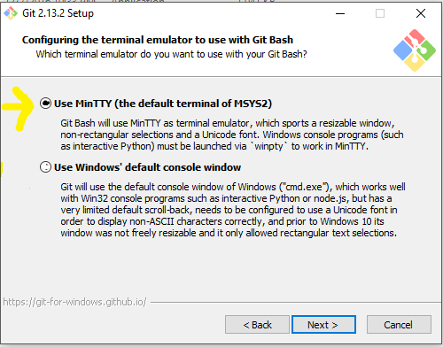
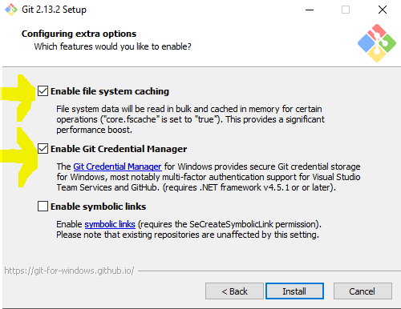
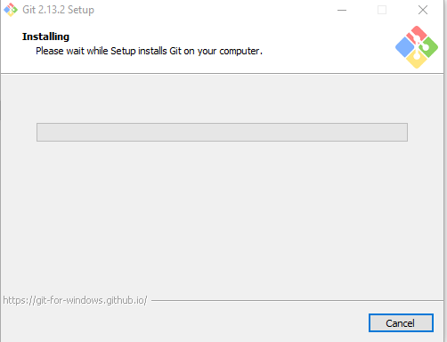

# What is Git ??
Git is Created by **_Linus Trovaldus_**.(responsible for the linux kernel.)
Git is a version control system (VCS). Git is a tool/software like your IDE or VLC player. It is not a programming language.It is a general tool.Chances For Hiring In a Company will be increased When u Mentioned Git ON ur Resumes.
# What Git Does ??
There are two main Reasons to Learn GIT.
1. Track changes to your code .
2. Save your code to the cloud .

# What is GitHub ??
Github is not the same as git. Github is a website/platform while git is a tool.
For Ex:- Git or Camera is just the tool, But Instagram or GitHub is the website.
**Github allows you to safely store your code in the cloud. And Also U can Share Your Code With Others.** Other websites such as gitlab, bitbucket which are similar to Github also exists . **Companies love it when you have a github profile and they can see your work before even calling you for an interview.**
* Now the Question Arises We Can do the same from Google Drive or DropBox, But the Solution is It Is Designed for special purpose(It even Track the record of code that u wrote 5 years ago. And what is it.)

### **Installation Steps For Git and GitHub , How to Create Repository, Add And Commit Your Code And How Push It On GitHub Using Git.**

## Pre-requisites (Basic Requirements.)
##### 1. **Git Installed In your System**. To Install Git [Click here.](https://git-scm.com/) U Will See below, what appears Next and what we Have to Do Next.


* After Downloading Simply Run the setup file, And click **Next**


* Check 2nd checkbox as shown and click **Next**


* Check with **_use the native window secure channel library_** and click **Next**


* Check with **_use MinTTY_** and click **Next**



* Check first two checkbox and click **Next**



* After That Installation process Start, Wait for Complete setup To Finish.



* Now Ur Git has Installed SuccessFully.

##### 2. **A GitHub Account** . If you don't have Account on GitHub,Create it By [Clicking here.](https://github.com/join) Make sure your username is professional. Note:- *coolsmartboy1994 or dhinchakpooja does not work.*


#### After Creating Account and Signing In, U Just have to **Create New Repository on Github**.

1. Open your Github account . You will see a page somewhat like this .


2. Click on **Start Project** Button to create a new project repository.Or you can also click on the **new repository** as shown in the bottom corner of the image to Create a Repo.

3. Once you have clicked you'll be directed to this page.


4. Enter the repository name you want to set. Remember, There are some conventions to naming the repositories . When you enter the name wait for a while until the green tick comes as shown in the image .

5. Then you can Click on the green **create Repository** button. (As shown Below)

6. Then you will be Redirected to the Next Page.


7. Now You **Succesfully** created a New Repository on GitHub .This Github Repo is often referred to as Remote repo. It Is Called So Because it is not close to you, it is remote, it is on the cloud.Every project needs one remote repo for itself.

8. Now we will see how we can **_push_** our data into the Repository .

## It Can Be Done by Using Git.

1. Once you have installed Git on your system we can push our projects through it.

2. Open Git Bash and The Window Will Appears Something like this.
 
3. The First two commands you need to run are just to get youself registered on Git.
```   
 git config --global.user "Your GitHub UserName"

 git config --global user.email "Your Valid Email-Id"
```
    
Note:-  **Make sure the username and email you entered are  Github registered** (_not necessary but makes work easy_)

4. Now you need to direct your Git to **The designatined folder In Which Project Related Files Are Present Which u wanna to Push On Github Remote Repository is Termed as _Local Repository_ .**  For that we use the ```cd "path"```  command .
   In the double quotes you need to enter the full path of your Local Repository.

   

5.  Now that we have reached at our project folder(Local Repository) the first thing  we need to do is  initialise An Empty Repository (as .git) in the Local Repository (Project Folder) .`git init` just like git k folder mein greh pravesh krna.
```
git init
```   


By Using this `git init` command, It will make a .git folder in your Local Repository.(Git creates a hidden folder called .git inside a folder that you want to track. Just this much makes a folder into a git repository.)As u can See Below.


6 . Now that we have created the git folder . We will now add the files to be pushed , It can be done in two ways:
* Using Selectively Approach.(In case u Wanna to Add Only a Specific Files out of bunch of many Files Present in ur local repository.)
```python
git add filename
```
* By Addding All Files.(In case u wanna to Add all the files and Folders which are present in your local repository)
```python
git add .
```
7 . Here We will use the `git add .`command, But u can also try Selective approach too.


8 . Once we have added the files in repo, the next thing we need to do is commit these changes By using `git commit` command and provide a message with commit .Commits are like check points or versions of your software.Even a new single line added to your code can count as a new version.So after you add the file you need to do a commit to make a version out of it.
Let's create the first commit or first version of our project:
```python

git commit -m "your commit message"

```
**Remember:** _The commit message should be a meaningful one ._  Like:-
1. The Bug is resolved.
2. Code has been Improved.
3. Additional Feature (also mention it) are added.


*9*.  Next we will connect our GitHub Remote Repo with this project (Local Repository)using the link given to us on the github page .(Simply Mapping It.)

 
 **Copy the blue highlighted part**

10 . Next we will use the HTTPS URI Link to Map or to Link our project(Local Repository) to Github(Remote Repository) .

*11*. For that we will use `git remote add origin ** paste ur copied URI Link here**` command.
```python
git remote add origin ** paste here**

```


12 . The last step is to **_push_** the changes to the repository.And For that We will use `git push origin master` command.
  ```python

git push origin master

```


13 . If everything you have done is correct and followed the Steps correctly your github repository should have been updated.,**Simply Refresh ur Browser and u will see Files are Added to GitHUB Remote repo From Local Repo.**


_It will shows something like this_

*14*.  In some Of the cases when you push the code, you might have to sign up .

 **Remember** : **_when Pushing your code to Github, Ur system is connected to Internet and the network should be working_**, Otherwise u have to face internet connection Error.

 Note:- Only Push command Requires Internet connection.

*15*. For the next times you just need to remember these commands _in this order_
 ```python
git add .
git commit -m "your message"
git push origin master

```

*16*. Some other useful commands are :

1.`git log` tells the no. of commits,commit history,gives commit id(**A commit id. Think of this as a unique version id which uniquely identifies that version of the commit. This is an alpha-numeric string. Ex: ca82a6dff817ec66f44342007202690a93763949**), and also shows the provided message along with that date and time on which commit has been done.
 ```python
git log #tells the log of your commits
```


*2*.`git status` it is a very useful command which tells us the status of the file which is being tracked(added)or not.The command tells you the current state of your project. It is like a report card of your project.
You will discover more about it as you start using git more and more.
```python

git status # used to know the status of the files being tracked or not

```

* now add more files to our project like: new.txt, main.txt(`git add new.txt`,`git add main.txt`)
* Also add some content in ur previous project files and the newly added files main.txt and new.txt*
* Now run the git status command,git will track the modied file too . now u have to again commit it via providing meaning message that file is modified .

**Please note that you have to add both new and modified files before you can make a new commit or version. That is you will need to tell git what all files are a part of the commit/version everytime. This is super important!!**

* Now push ur code to Github again.

17 . I hope all these Things are cleared to u ,,`Thank you .`

# A quick Revision of the used commands.
* `git init` - Create an empty git repository
* `git add .` - Add all files to the next commit/version
* `git status` - Gives the status for thr files which are tracked,untracked and modified.
* `git commit -m "Your meaningful message here"` - Create a commit/version of the proejct
* `git log` - See commit/version history of the project
* `git remote add origin 'Paste your link for remote repo here'` to add the link btw remote repo and local repo.
* `git push origin master` - To push your code ,your project project file to Remote repo from local repo.
