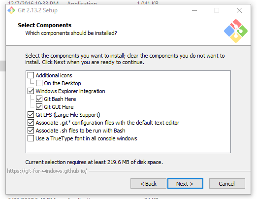
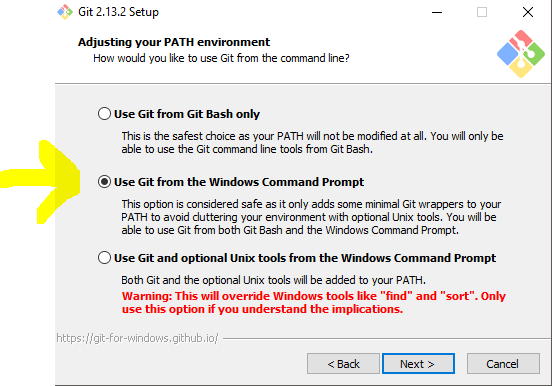
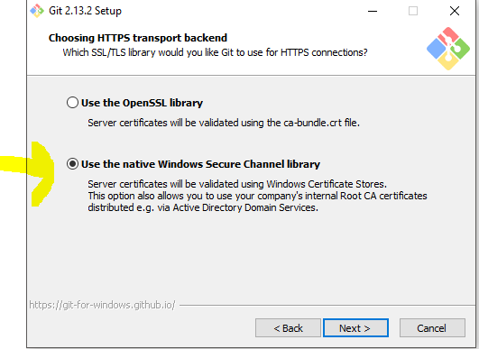

# Using Git and GitHub

## Pre-requisites
* A GitHub Acoount . If you don't have one make it [here](https://github.com/join)
* Git . Install Git [here](https://git-scm.com/)

* Run the setup file,click **next** 

* Check 2nd checkbox as shown and click **next**

* Check with **_use the native window secure channel library_** and click **next**

* Check with **_use window's default console window_** and click **next**

* Check first two checkbox and click **next**

* Installation process start

 
## Create new repository on Github

1. Open your Github account . You will see a page somewhat like this .

2. Click on **Start Project** Button to create a new project repository.
3. Alternatively you can also click on the **new repository** as shown in the bottom corner of the image .
4. Once you have clicked you'll be directed to this page.

5. Enter the repository name you want . Remembere there are some conventions to naming the repositories .
When you enter the name wait for a while until the green tick comes as shown in the image .
6. Then you can Click on the green **create Repository** button .
7. Then you will be redirected to the next page.

8. You have **succesfully** created a new repository on github .
9. Now we will see how we can **_push_** our data in the repository

## Using Git

1. Once you have installed Git on your system we can push our projects through it.
2. Open Git Bash and you will something like this.
 
3. The First two commands you need to run are just to get youself registered on Git.
```   
 git config --global.user "santk97"
    
 git config --global user.email "****@gmail.com"
```
    
*  **Make sure the username and email you enter are  github registered**(_not necessary but makes work easy_)

4. Now you need to direct your git to the destined folder .For that we use the ```cd "path"```  command .
   In the double quotes you need to enter the full path of your project .
   
   
5  Now that we have reached ou project folder the first thing  we need to do is  initialise out git in the project .
``` 
git init 
```   
Use this  command. It will make a .git folder in your project .


6 . Now that we have created the git folder . We will now add the files to be pushed , It can be done in two ways:
* Selectively
```python
git add filename
```
* All Files
```python
git add .
```
7 . We will use the    _**git add .**_ command

8 . Once we have added , the next thing we need to do is commit these changes .
```python

git commit -m "your commit message"

```
**Remember:**_The commit message should be a meaningful one ._


9. Next we will connect our GitHub repo with this project using the link given to us on the github page .
 
 **Copy the blue highlighted part** 
 
10 . Next we will use the URI Link to connect our project to github .

11. For that we will use 
```python
git remote add origin ** paste here**

```


 
12 . The last step is to to **_push_** the changes to the repository.
  ```python

git push origin master

```


13 . If everything you have done is correct and followed the guide correctly your github repository should have been updated.

_something like this_
 
14.  In some cases when you push you might have to sign up . 
 **Remember** : _when pushing your network should be working_
 
15. For the next times you just need to remember these commands _in this order_
 ```python
git add . 
git commit -m "your message"
git push origin master 

```
 
16. Some other useful commands are :
 ```python

git log #tells the log of your commits 
```


```python

git status # used to know the status of the files being tracked or not

```


17 . Thank you . 
